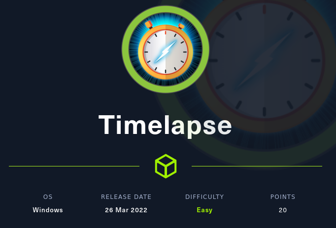

# Hack the Box - Timelapse



Reconhecimento:

NMAP SCAN

```bash
┌──(red_arrow㉿kali)-[~]
└─$ nmap -sV -Pn -p- --min-rate 1000 10.10.11.152 -v
Starting Nmap 7.92 ( https://nmap.org ) at 2022-04-01 22:20 EDT                                                             
PORT      STATE SERVICE       VERSION                                                                              
53/tcp    open  domain        Simple DNS Plus                                                                      
88/tcp    open  kerberos-sec  Microsoft Windows Kerberos (server time: 2022-04-02 10:27:50Z)                       
135/tcp   open  msrpc         Microsoft Windows RPC                                                                
139/tcp   open  netbios-ssn   Microsoft Windows netbios-ssn
389/tcp   open  ldap          Microsoft Windows Active Directory LDAP (Domain: timelapse.htb0., Site: Default-First-Site-Name)
445/tcp   open  microsoft-ds?
464/tcp   open  kpasswd5?
593/tcp   open  ncacn_http    Microsoft Windows RPC over HTTP 1.0
636/tcp   open  tcpwrapped
3268/tcp  open  ldap          Microsoft Windows Active Directory LDAP (Domain: timelapse.htb0., Site: Default-First-Site-Name)
3269/tcp  open  tcpwrapped
5986/tcp  open  ssl/http      Microsoft HTTPAPI httpd 2.0 (SSDP/UPnP)
9389/tcp  open  mc-nmf        .NET Message Framing
49667/tcp open  msrpc         Microsoft Windows RPC
49673/tcp open  msrpc         Microsoft Windows RPC
49674/tcp open  ncacn_http    Microsoft Windows RPC over HTTP 1.0
49696/tcp open  msrpc         Microsoft Windows RPC
53816/tcp open  msrpc         Microsoft Windows RPC
Service Info: Host: DC01; OS: Windows; CPE: cpe:/o:microsoft:windows
```

Dentre várias portas abertas, podemos ver que as portas 139 e 445 SMB estão abertas.

Vamos enumerar os compartilhamentos desse serviço.

Listando as pastas do SMB.

```bash
┌──(red_arrow㉿kali)-[~]
└─$ smbclient -L //10.10.11.152/
Enter WORKGROUP\red_arrow's password: 

        Sharename       Type      Comment
        ---------       ----      -------
        ADMIN$          Disk      Remote Admin
        C$              Disk      Default share
        IPC$            IPC       Remote IPC
        NETLOGON        Disk      Logon server share 
        Shares          Disk      
        SYSVOL          Disk      Logon server share 
Reconnecting with SMB1 for workgroup listing.
do_connect: Connection to 10.10.11.152 failed (Error NT_STATUS_RESOURCE_NAME_NOT_FOUND)
Unable to connect with SMB1 -- no workgroup available
```

Dentro da pasta Shares temos:

```bash
┌──(red_arrow㉿kali)-[~]
└─$ smbclient //10.10.11.152/Shares
Enter WORKGROUP\red_arrow's password: 
Try "help" to get a list of possible commands.
smb: \> ls
  .                                   D        0  Mon Oct 25 11:39:15 2021
  ..                                  D        0  Mon Oct 25 11:39:15 2021
  Dev                                 D        0  Mon Oct 25 15:40:06 2021
  HelpDesk                            D        0  Mon Oct 25 11:48:42 2021

                6367231 blocks of size 4096. 1152581 blocks available
smb: \>
```

Dentro da pasta Dev temos um arquivo de backup

```bash
smb: \> cd Dev
smb: \Dev\> ls
  .                                   D        0  Mon Oct 25 15:40:06 2021
  ..                                  D        0  Mon Oct 25 15:40:06 2021
  winrm_backup.zip                    A     2611  Mon Oct 25 11:46:42 2021

                6367231 blocks of size 4096. 1152580 blocks available
smb: \Dev\>
```

Dentro da pasta HelpDesk temos

```bash
smb: \> cd HelpDesk
smb: \HelpDesk\> ls
  .                                   D        0  Mon Oct 25 11:48:42 2021
  ..                                  D        0  Mon Oct 25 11:48:42 2021
  LAPS.x64.msi                        A  1118208  Mon Oct 25 10:57:50 2021
  LAPS_Datasheet.docx                 A   104422  Mon Oct 25 10:57:46 2021
  LAPS_OperationsGuide.docx           A   641378  Mon Oct 25 10:57:40 2021
  LAPS_TechnicalSpecification.docx      A    72683  Mon Oct 25 10:57:44 2021

                6367231 blocks of size 4096. 1147148 blocks available
smb: \HelpDesk\>
```

Após fazer o download dos arquivos encontrados, vemos que o arquivo winrm_backup.zip está protegido por senha. 

Vamos usar o zip2john para extrair o hash da senha do arquivo compactado para que seja possível fazer o bruteforce

```bash
┌──(red_arrow㉿kali)-[~/Documents/HackTheBox/Timelapse]
└─$ zip2john winrm_backup.zip > password.txt
ver 2.0 efh 5455 efh 7875 winrm_backup.zip/legacyy_dev_auth.pfx PKZIP Encr: TS_chk, cmplen=2405, decmplen=2555, crc=12EC5683 ts=72AA cs=72aa type=8
```

Faremos um bruteforce para tentar quebrar a senha:


Após extrair o conteudo, temos acesso a um arquivo pfx com senha.

Vamos usar o pfx2john para extrair o hash da senha novamente

```bash
┌──(red_arrow㉿kali)-[~/Documents/HackTheBox/Timelapse]
└─$ pfx2john legacyy_dev_auth.pfx > legacy.txt
```

Vamos tentar quebrar a senha denovo usando o john.


Agora que temos a senha, vamos extrair o certificado e a chave  do client do arquivo pfx.

```bash
┌──(red_arrow㉿kali)-[~/Documents/HackTheBox/Timelapse]
└─$ openssl pkcs12 -in legacyy_dev_auth.pfx -nocerts -out legacyy.key
Enter Import Password:
Enter PEM pass phrase:
Verifying - Enter PEM pass phrase:

┌──(red_arrow㉿kali)-[~/Documents/HackTheBox/Timelapse]
└─$ openssl pkcs12 -in legacyy_dev_auth.pfx -clcerts -nokeys -out legacyy.crt
Enter Import Password:
```

Como visto no scan do nmap, temos a porta 5986 - WinRM aberta.

Agora que temos os certificados do client, tentaremos acessar um powershell remoto com o evil-winrm


Conseguimos acesso a máquina.

Buscando nos diretórios que temos acesso, achamos a flag de usuario (user.txt) no Desktop do usuário que estamos logados.


Continuando a exploração, vamos olhar no histórico do powershell para ver se encontramos algo de interessante.

Conseguimos achar as credenciais de outro usuário.


Agora podemos acessar ao powershell remoto usando o usuário e a senha que encontramos.


Ao enumerar os usuários do AD, encontramos o user Administrator 


Além do arquivo de backup que encontramos no SMB, também encontramos vários documentos a respeito da implantação do serviço LPAS.

Sabendo que as senhas do ‘Administrator’ são salvas localmente no Active Directory, vamos tentar fazer o dump das credenciais.


Agora que temos a senha do Administrator, vamos fazer login usando novamente o Evil-WinRM.


Após um tempo buscando a flag do root, que não estava no Desktop do user, como de costume, tentei ver nos outros usuários.

E estava no Desktop de outro usuário.


E assim conseguimos comprometer a máquina e conseguir as duas flags.

